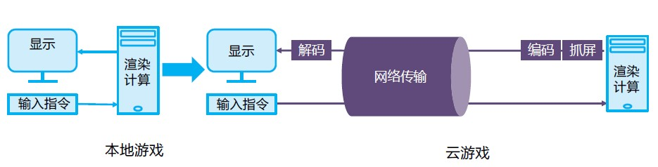
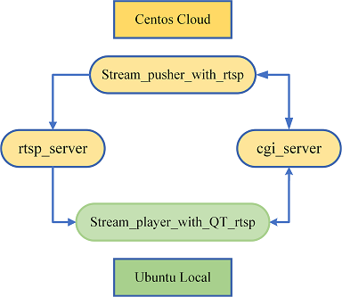
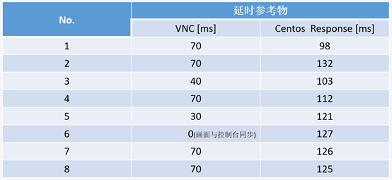
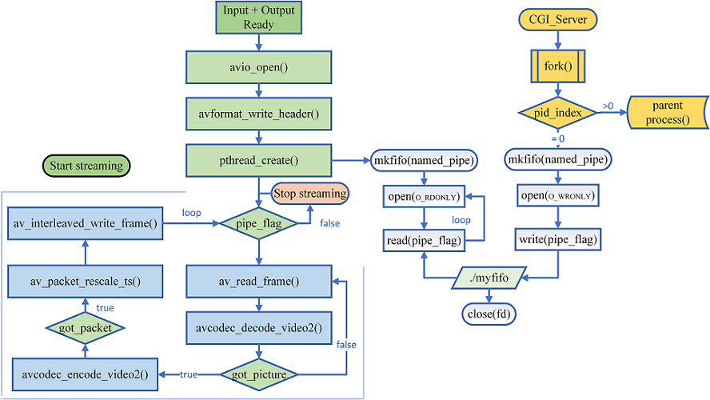
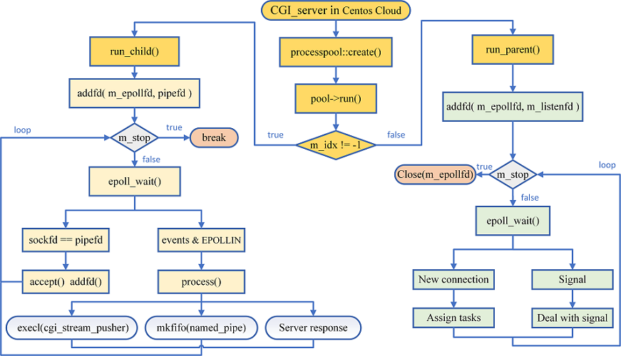
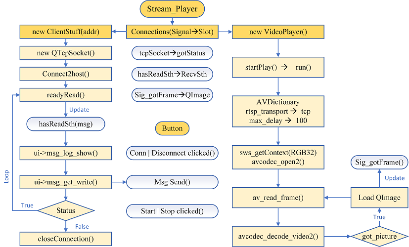
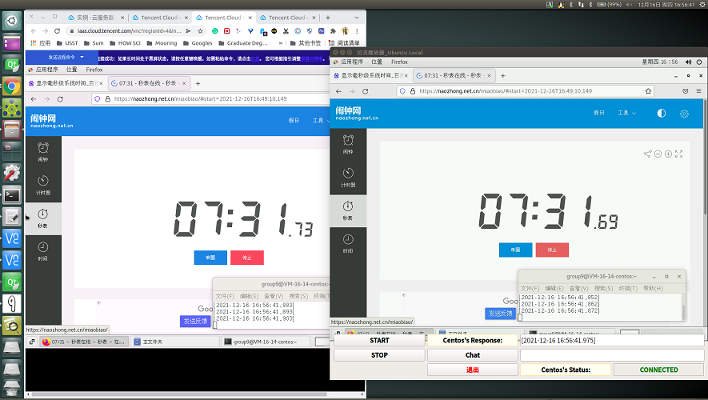

## CloudGame-RTSP-CGIServer-Yinli_Plan

**本项目依赖于Linux环境，结合RTSP流协议，实现了云服务器Centos 7 抓屏编码推流，并在本地Ubuntu系统结合QT实现拉流解码显示，以及采集本地操作指令上传云端实现交互。**

云游戏将游戏资源、运行、内容的存储、计算和渲染都转移到云端，实时的游戏画面串流到终端进行显示，最终呈现到用户眼中。与本地游戏相比，云游戏增加了【抓屏、编码、网络传输、解码】等主要过程，即**流化过程**。

- **图 1 云游戏典型架构图**

- **图 2 本方案各服务节点框架示意图**

- **表 1 开发环境及服务节点清单说明**

| 云端：腾讯云CVM高IO型服务器 Centos 7 | 任务线（推流 + 流管理 + 交互连接管理）                       |
| ------------------------------------ | ------------------------------------------------------------ |
| stream_pusher_with_rtsp              | 抓取云端桌面 + 编码推流至rtsp_server.                        |
| rtsp_server                          | 依循rtsp协议负责流分发管理。曾经尝试采用Nginx代理方式，但在该场景下测试rtsp_server时延更占优势。 |
| cgi_server                           | 基于socket、epoll、进程池实现高并发处理，以及与多客户端之间的操作指令交互与消息通信管理。 |
| **本地Ubuntu16.04 + Qt**             | **任务线（拉流 + 交互）**                                    |
| stream_player_with_qt                | 拉取云端视频流，并解码显示；采集本地操作指令并上传云端实现交互。 |

**本方案最终实现效果：**

- **表2 客户端时延数据随机测试统计（约为70~100ms）**

### 整体方案设计说明

### **（1）云端·推流端设计**

- **图 3 推流端中抓屏输入端与输出端【初始化及参数配置】**

​	**此处承接上一模块，至此，抓屏解码输入口、编码推流输出口两者均已进入准备就绪状态。**

- **图 4 推流端与流分发管理服务之间【逻辑交互细节流程】**

**本案至此，已完成在云上推流端的编码推流以及交互接口设计。**

**此时，云端的码流则将推送至云上流分发及交互管理服务端：`rtsp_server`以及`cgi_server`。**

------

### **（2）云端·流分发及并发管理端设计**

**本节所述的设计内容，将负责本方案中的云上流分发以及与本地客户端之间的连接及交互管理`cgi_server`。**

**另外，在云服务器上同时运行了一路`rtsp_server`中转服务。**

- **图 5 云上流分发及并发管理端设计细节流程**

该服务中维护了一组进程池，在父子进程中各自分别维护了一组内核事件表。当有新的拉流请求到来时，主进程将通过典型的轮流选取算法来主动选择某一子进程来为之服务。当选好子进程之后，子进程中找到与父进程之间预先建立好的管道，并通过该管道来实现两者之间的通信。

------

### （3）本地·拉流解码显示及指令交互管理端设计

**当根据rtsp协议建立起拉流连接后，循环捕捉码流，并【解码】后触发QT信号通知UI界面作实时更新显示。**

- **图 6 客户端设计细节流程**

### （4）最终方案效果展示

<video width="1920" height="700" controls>
    <source src="photos/Final.mp4" type="video/mp4">
</video>

------

### **以上实现所涉及的云平台技术理论**

**x86 架构的云平台主要针对于 PC 端游和主机游戏的云化，ARM 架构的云平台主要针对手游的云化。**

1. **GPU 虚拟化与无盘**

   - 目前云平台的资源管理和调度有两种主流的方案——**【虚拟化方案】和【物理机方案】。**
     - **虚拟机流派**一般采用服务器和专业显卡的云端资源组合，并以虚拟化的方式分配资源，较为灵活。

2. **音视频抓取**

   - 流化的第一步是抓取游戏的实时画面，如果是 PC 游戏，则是抓取屏幕的画面。
   - **本方案云端是基于Centos 7，因此采用`x11grab`进行抓屏；**

3. **编码技术**

   **云端在抓取到原始游戏画面后，由于数据量巨大，不宜直接传输，需要经过编码压缩后才做网络传输。**

   - **a）H264 和 H265 是常见的视频编码标准。**

     **H264** 相较于以前的编码标准，增加了参考帧的运动补偿、帧内预测等新特性，视频质量更高，码率更低，因此得到了广泛使用。

     **H265** 在架构上与 H264 相似，但 H265 在图像分块、变换编码、预测编码、熵编码等模块上提出了更优的算法，提高了编码的压缩率、鲁棒性，在相同画质的情况下理论上 H265 能比 H264 节省一半的带宽。

     - 不过，H265 压缩率的提升使得解码的复杂度更高，理论上解码的运算量约是 H264 的 2 倍，所以对解码硬件提出了更高要求。

     **本方案根据现有可用服务器资源，以及权衡码率和图像质量两者之间的关系，最终决定采用`H264`的编码方式。**

     无论使用 H264 还是 H265 进行编码，都需要**对码率大小**和**图像质量**进行权衡，并选择**合适的编码参数**。

   - **b）硬编码和软编码**

     **软编码**是使用 CPU 进行编码，实现直接、简单，**同码率下质量较高**，但由于对 CPU 的负载较重，性能相对较低。

     **硬解码**主要使用 GPU 等进行编码，性能高，速度快，但同码率下**质量不如软编码。**

     **通常，云游戏对于延迟的要求非常严苛，因此一般采用硬编码。**

     **注释**：结合本项目可用资源的特性，当时申请到的是**腾讯云CVM高IO型服务器**，所以采用软编码的方式实现。

   - **c）无B帧编码**

     编码序列中一般有 I 帧、B 帧、P 帧，**其中 I 帧是关键帧，P 帧是前向预测编码帧，B 帧是双向预测编码帧。**

     **云游戏从编码的时延、效率、实现复杂度等角度考虑，常常采用无 B 帧编码。**

     - **即第一帧是 I 帧，之后的都是 P 帧，只有在网络很差导致了断连的情况下，才会重新再发一个 I 帧。**

     - **无 B 帧编码的优势是**，除了 I 帧，之后的每一帧，都可以根据前面一帧来完成编码，实现简单，而且每抓屏一次就可以立刻送往编码，不产生额外的延迟。相应的，P 帧的压缩率较低，需要的带宽更大。

     - **有 B 帧编码的优势是**，B 帧压缩率更高，更节省带宽，但 B 帧需要等到后面的 P 帧才能完成编码，所以产生了**至少一个帧间隔的延迟**。

     **时延优化是云游戏的重点，因此无 B 帧编码是优选，I 帧后续都是 P 帧，也利于保持帧间隔的稳定。**

     **音频也有编码标准**，常见的有 AAC、MP3、WMA、PCM 等，但由于音频的数据量比较小，有些云游戏平台并没有做音频的编码压缩过程，而是采样后直接传输。

4. **解码技术**

   - 编码后的图像经过网络到达终端后，终端需要对其解码，才能在屏幕显示出来。

     **解码的过程与编码的过程是相反的，主要有【熵解码、反量化、反变换、预测】几个步骤。**

     **同样解码也有软解码和硬解码的区别**。

     - **软解码**主要依靠软件，在CPU上完成；
     - **硬解码**主要调用GPU 的专门模块完成。
     - 硬解码的性能和效率更高，且在硬件不断发展下，硬解码的质量不比软解码差，甚至还优于软解码，所以商业应用上通常【首选硬解码】。
     - **注释**：结合本方案所拥有的CVM高IO型服务器的资源特性，故采用软解码的方式。

5. **推流技术**

   - **云游戏业务对时延要求高，任何过多的报文封装和解封装都会引入额外的时延。**

   - **目前主要采用 TCP 或 UDP 直接封装应用层数据。**

     - **TCP传输过程中，丢包、乱序等引发重传，会导致游戏的操作响应变慢。**

     - **UDP不会重传，实时性较好，但丢包时损失了画面质量。**

6. **部分关键技术指标**

   - **a）码率。**

     **云游戏视频编码过程就是在云游戏平台上将视频流压缩的过程。**

     **不同视频编码技术的压缩率不同，压缩率越高、视频传输的码率越低，同时不可避免会增大编码与解码所需要的时间。**

     **因此需要结合带宽需求、画面质量和处理延迟，选择一个合适的推流码率。**

     ​		可通过客观测量指标 PSNR（Peak signal-to-noise ratio，峰值信噪比，评价压缩后重构图像与原图像的差异）和 SSIM（structural similarity index，结构相似性指数，衡量两个压缩前后的图像相似程度），综合评估不同码率下的游戏画面差异 / 相似度，测算出最优的推流码率。

   - **b）时延。**

     - **时延是影响云游戏体验质量和成功与否的关键因素。云游戏将云端渲染好的游戏画面串流后，通过网络传输到终端显示。网络传输的各个环节，不可避免地会产生时延、丢包、抖动等网络损伤。**

       **从敲击键鼠到屏幕上游戏角色产生动作，其端到端时延主要包括：**

       ①   键鼠 / 手柄的操控指令采集时延

       ②   指令上传时延

       ③   云端逻辑计算时延

       ④   云端画面渲染时延

       ⑤   画面抓取、视频编码时延

       ⑥   下行视频流传输时延

       ⑦   终端解码时延

       ⑧   画面显示时

     - **云游戏流化时延由云管端共同承担，包括【云端画面抓取和视频编码时延】、【终端解码时延】、【网络传输时延】三大部分。**

     - 通过【**定制云游戏网络传输协议**】、【**提高网络流量使用效率**】等方法，能够**有效改善网络传输质量**，**提升用户体验**。

   - **c）抖动。**

     **帧率是游戏玩家十分看重的指标，但是单纯的提升帧率是远远不够的。**

     对于云游戏而言，144 高帧数下，游戏画面有时候依然不流畅，这其实是**帧间隔不稳定导致的。**

     游戏画面是实时变化的，排队积压之后将导致某些本应需要显示的**画面被舍弃掉，故而出现卡顿、跳帧现象。**

     **在当前硬件编解码相对可控的条件下，** **网络抖动**是**造成帧间隔不稳定的根本原因。**

------

**Reference**

[1] https://digitalcommons.unl.edu/cgi/viewcontent.cgi?article=1105&context=elecengtheses

[2] https://www-file.huawei.com/-/media/corporate/pdf/ilab/2019/cloud_game_whitepaper.pdf

[3] http://www.nrta.gov.cn/module/download/downfile.jsp?classid=0&filename=68ee1c8ce42347bca487f0ecfad396d2.pdf

------

